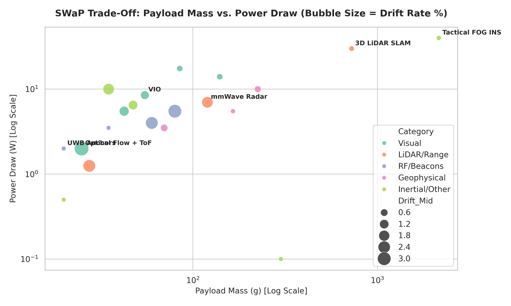
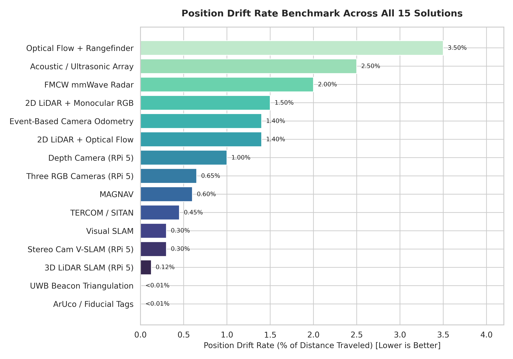
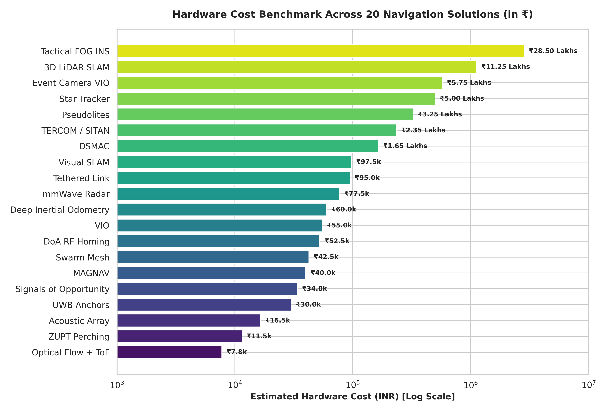
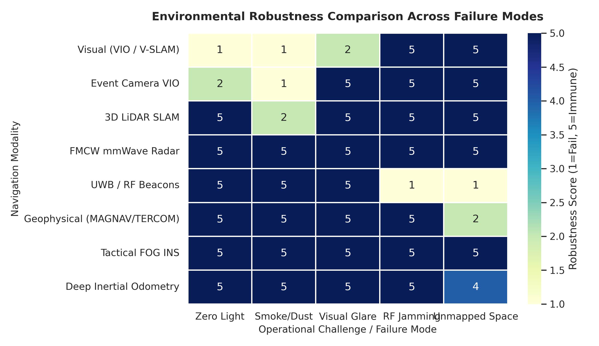

<p align="center">


</p>

<h1 align="center">GPS-Denied Autonomous UAV Navigation</h1>

<p align="center">
  <em>Onboard, GNSS-free state estimation, SLAM, and obstacle avoidance for indoor &amp; EW-contested flight</em>
</p>

<p align="center">
  
  
  
  
  
  
</p>

<p align="center">
  <a href="#quick-links">Quick Links</a> •
  <a href="#overview">Overview</a> •
  <a href="#tech-stack">Tech Stack</a> •
  <a href="#system-architecture">Architecture</a> •
  <a href="#quantitative-analysis">Analysis</a> •
  <a href="#getting-started">Getting Started</a> •
  <a href="#key-performance-indicators">KPIs</a> •
  <a href="#roadmap">Roadmap</a>
</p>

---

## Quick Links

| Resource | Description |
| :--- | :--- |
| 📄 [Problem Statement](PROBLEM_STATEMENT.md) | Formal problem definition, state-space math, MAP formulation, KPIs |
| 💡 [Candidate Solutions](SOLUTIONS.md) | 15 hardware/software architectures for GPS-denied navigation |
| 📊 [Quantitative Analysis](ANALYSIS_SOLUTIONS.md) | Statistical decision-matrix analysis of those 15 solutions |
| 🧾 [Bill of Materials](BOM.md) | Hardware BOM with pricing (INR) and selection rationale |
| ☁️ [Google Drive — Documents](https://drive.google.com/drive/folders/1eQoDXTlVj3ZABpU9uxMFRTQ5T66ZaTJB?usp=sharing) | All related documentation & design artifacts |

---

## Overview

Modern UAVs depend on GNSS (GPS/GLONASS/Galileo/BeiDou) for positioning. In blocked or jammed environments, low-cost MEMS IMUs fall back to dead-reckoning, and position error grows **quadratically** — a crash within minutes.

This repository designs, analyzes, and prototypes a **fully onboard navigation stack that never relies on satellite signals**, targeting:

- 🏭 **Physical obstruction** — subterranean mines, tunnels, indoor factories, urban canyons
- ⚡ **Electronic warfare (EW)** — RF jamming, spoofing, EMI in contested airspace

We explore **15 candidate navigation modalities**, narrow them through a statistical decision framework, select a **Stereo Camera + Raspberry Pi 5 + PX4** architecture, and validate it against a concrete, budget-constrained build (₹45.6k).

---

## Tech Stack

### Compute & Operating System

| Component | Role |
| :--- | :--- |
| **Raspberry Pi 5 — 8GB** | Onboard edge compute: perception, depth, costmap, V-SLAM |
| **Ubuntu / Debian (ARM64)** | Flight-vehicle compute OS |

### Middleware & Autonomy

| Stack | Purpose |
| :--- | :--- |
| **ROS 2 (Humble)** | Node-based robotics middleware, pub/sub, TF2, lifecycle |
| **Nav2** | Global/local path planning, costmaps, recovery behaviors |
| **V-SLAM / Visual Odometry** | ORB-SLAM3, VINS-Fusion (stereo-inertial) |
| **OpenCV 4.x** | Feature extraction, depth/point-cloud, ArUco detection |
| **EKF / Factor-Graph Smoothing** | Multi-sensor state estimation & loop closure |
| **MAVLink / mavros** | Flight-controller link & offboard mode control |

### Firmware & Control

| Stack | Purpose |
| :--- | :--- |
| **PX4 Autopilot** | Real-time stabilization & control on the Kakute H7 |
| **Holybro Kakute H7 (STM32H7)** | Flight controller: `100 Hz` attitude/rate loops |
| **Raspberry Pi Pico (option)** | Dedicated low-latency sensor telemetry / GPIO |

### Sensor Payload

| Sensor | Role |
| :--- | :--- |
| **SC132GS Binocular Stereo Camera** | Visual odometry, depth, point clouds, ArUco tags |
| **IMU (on FC + optional external)** | Gyro/accel fusion for VIO |
| **Optical Flow + Rangefinder (option)** | Velocity + altitude hold |

### Radio & Power

| Component | Purpose |
| :--- | :--- |
| **RadioMaster Pocket ELRS** | Manual pilot override (low-latency 2.4 GHz) |
| **RadioMaster RP1 ELRS Nano** | Receiver on the drone |
| **Tattu R-Line 850 mAh 4S 150C** | ~10 min flight power |

### Analysis Toolchain

| Tool | Purpose |
| :--- | :--- |
| **Python 3** / `pandas` / `matplotlib` / `seaborn` | Quantitative charting & MCDA visualization |
| **LaTeX math rendering** | Formal formulations in docs |

---

## System Architecture

```
                        +-----------------------------+
                        |    Heterogeneous Sensors    |
                        | (Stereo Cam, IMU, Optional  |
                        |  Flow + Rangefinder)        |
                        +--------------+--------------+
                                       |
                                       v
                        +-----------------------------+
                        |  Raspberry Pi 5 (ROS 2)     |
                        |  ┌ Feature Extraction       |
                        |  ├ Depth & Point Cloud      |
                        |  ├ V-SLAM / VIO             |
                        |  ├ ArUco / Localization     |
                        |  └ Costmap & Global Planner │
                        +--------------+--------------+
                                       |
                                       v
                        +-----------------------------+
                        |  State Estimator (EKF /     |
                        |  Factor Graph + Loop Close) |
                        +--------------+--------------+
                                       |
                                       v
                        +-----------------------------+
                        |  Offboard Velocity          |
                        |  Setpoints via MAVLink      |
                        +--------------+--------------+
                                       |
                                       v
                        +-----------------------------+
                        |  Kakute H7 — PX4 (100 Hz)   |
                        |  Attitude / Rate / Mixer    |
                        +--------------+--------------+
                                       |
                ┌──────────────────────────┐
                v                          v
        ELRS RF Link                 ESCs → Motors
        (Manual Override)
```

**Data flow:** Sensors → RPi 5 (ROS 2 perception + planning) → state estimator → MAVLink offboard setpoints → PX4 flight controller → actuators, with an ELRS manual-safety override in parallel.

---

## Quantitative Analysis

`analysis.py` generates **12 charts** from the decision matrix in `ANALYSIS_SOLUTIONS.md` (drift %, power W, payload g, update Hz, range m, cost INR).

### MCDA Top-3 by Mission Profile

| Mission Profile | 1st | 2nd | 3rd |
| :--- | :--- | :--- | :--- |
| **Defense / Contested** | FMCW mmWave Radar | 3D LiDAR SLAM | Event-Camera Odometry |
| **Underground Inspection** | 3D LiDAR SLAM | FMCW mmWave Radar | Depth Camera (IR) |
| **Sub-250g Micro UAV** | Optical Flow + Rangefinder | UWB Beacon Triangulation | ArUco Tag Tracking |

### Chart Gallery

<details>
<summary><b>View all 12 charts</b></summary>

| Chart | File |
| :--- | :--- |
| SWaP trade-off (payload vs power, bubble = drift) | `1_swap_tradeoff.png` |
| Drift-rate benchmark | `2_drift_rate_comparison.png` |
| Hardware cost benchmark (INR) | `3_cost_benchmark_inr.png` |
| Environmental robustness heatmap | `4_robustness_heatmap.png` |
| Cost-effectiveness (drift vs cost) | `5_cost_effectiveness.png` |
| Weight penalty (drift vs payload) | `6_drift_vs_payload.png` |
| Total robustness ranking | `7_robustness_total.png` |
| Cost distribution per category | `8_cost_by_category.png` |
| Multi-criteria radar profiles | `9_radar_profiles.png` |
| Update rate vs drift | `10_update_rate_vs_drift.png` |
| Range vs drift | `11_range_vs_drift.png` |
| MCDA top-3 scenario scores | `12_mcda_scenarios.png` |

</details>






---

## Getting Started

### Prerequisites

- Python 3.10+
- Dependencies: `pandas`, `matplotlib`, `seaborn`

```bash
pip install pandas matplotlib seaborn
```

### Regenerate the analysis

```bash
python3 analysis.py
```

Regenerates all **12 PNG charts** in the repository root.

### Hardware bring-up (roadmap)

1. Flash PX4 on the Kakute H7 and verify basic manual flight.
2. Install ROS 2 Humble + `mavros` on the Raspberry Pi 5.
3. Connect stereo camera; calibrate intrinsics/extrinsics.
4. Run V-SLAM/VIO per the [Roadmap](#roadmap).

---

## Key Performance Indicators

| Metric | Target | Baseline (Dead-Reckoning) |
| :--- | :--- | :--- |
| Absolute Trajectory Error (ATE) | `$< 0.5\%$` of path length | `$> 10\%$` |
| Stationary Hover Drift | `$\le \pm 5$` cm / 10 min | Unbounded (`$\ge 2$` m/min) |
| State Update Rate | `$\ge 100$` Hz; Vision `$\ge 30$` Hz | Frame drop → filter divergence |
| Onboard Compute Envelope | `$\le 15$` W | Off-board cloud reliance |
| Lighting Adaptability | `$0$` – `$10{,}000+$` lux | Fails below 50 lux |

---

## Roadmap

- [ ] Baseline IMU-only dead-reckoning harness for drift measurement
- [ ] Stereo camera intrinsic calibration + ROS 2 camera pipeline on RPi 5
- [ ] V-SLAM / visual-odometry bring-up (e.g., ORB-SLAM3, VINS-Fusion)
- [ ] Depth & point-cloud generation for obstacle avoidance
- [ ] PX4 integration via MAVLink; offboard velocity control
- [ ] ArUco marker localization testbed
- [ ] Hover-drift and ATE benchmarking against KPIs above

---

## Contributing

This is an exploratory research repository. Suggestions, test data, and implementation PRs are welcome.

1. Fork the repository.
2. Create a feature branch: `git checkout -b feature/my-idea`
3. Commit your changes and open a pull request.

---

## License

Not yet specified. See the repository owner for licensing terms.

---

<p align="center">
  <sub>Built for research-grade indoor &amp; contested-environment autonomy · No GNSS required</sub>
</p>
